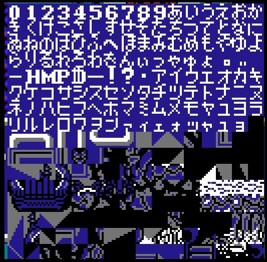
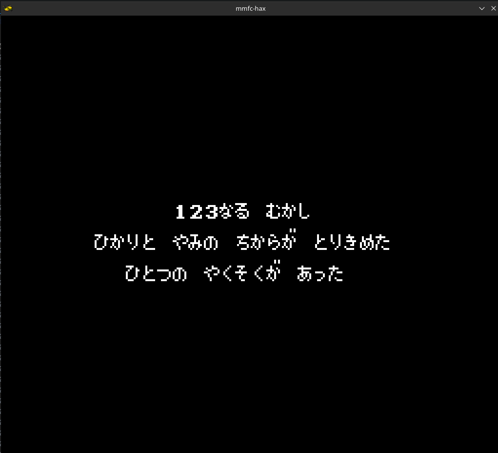
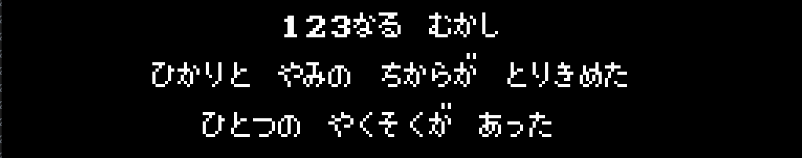
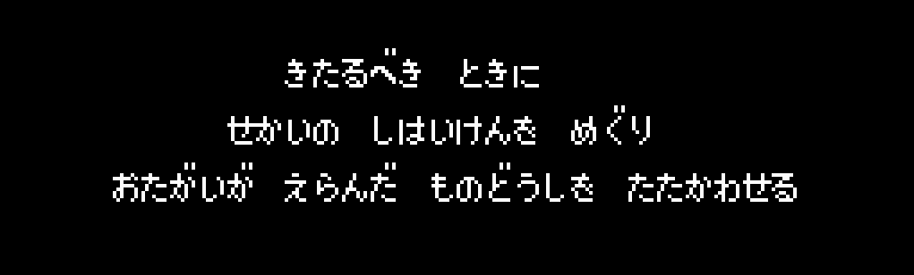
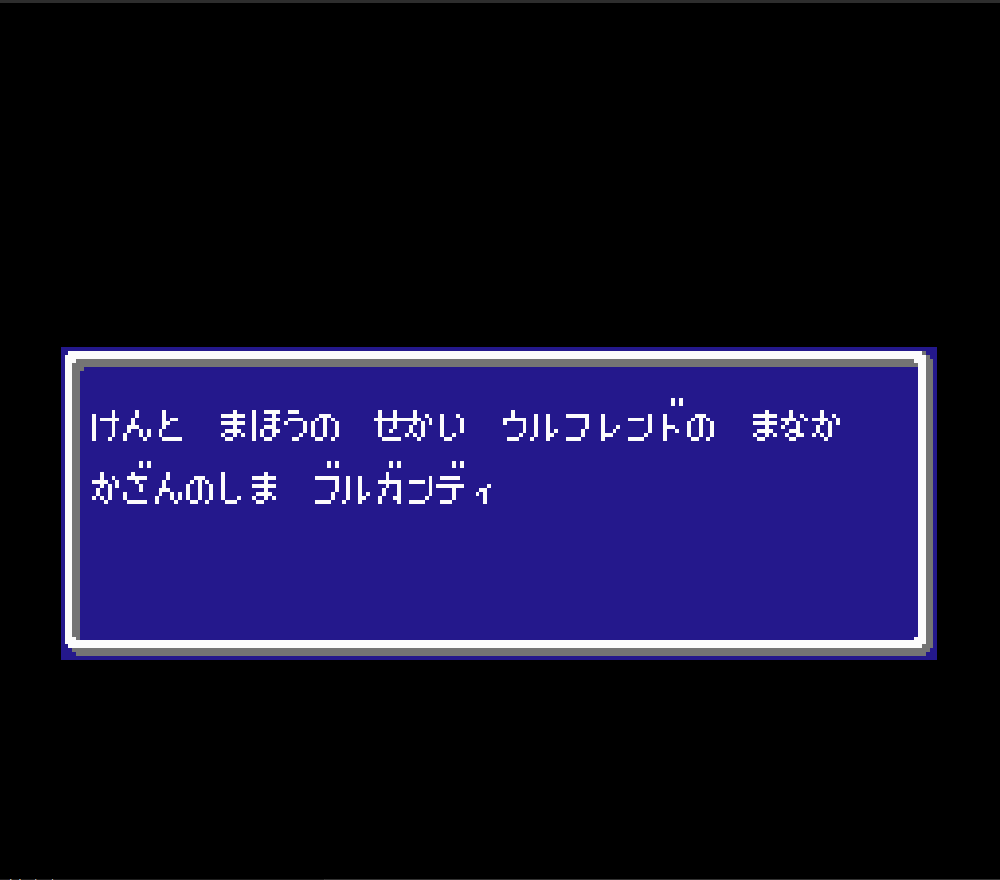

# Translating Monster Maker FC

## Introduction

Full disclosure; this will be a hacker's view into translating a video game. I will likely use brute force and observed behavior over in depth research and cunning plans. 

I have many years of programming experience, but I've never written NES software or 6502 assembly. When in school I did some light programming for the Gameboy and Dreamcast VMU as a hobby. I know a little assembly, but it's been decades since I've used it. I've _skimmed_ some of the NES / Famicom hardware documentation. 

I have virtually no knowledge of Japanese other than a few words and the understanding that there are katakana and hiragana (and maaaaaaybe a few kanji) characters shown on screen in the game.

All that aside, this is 100% doable even by a schlub like me!

### Dev Environment

I'm on Linux and Linux sucks for development of NES games. Emulators and debuggers are okay-ish (I think), but I spent a bit looking for a tile / map editor and nothing is great, especially if you want to inspect a ROM. 

Here's what I'm using right now:

- vscode + Microsoft's hex editor extension (there are better hex editors in linux, I know)
- mednafen (has an okayish debugger, not as good as nocash or fceux)
- whatever random CLI linux tools I have

I will eventually build some tools that will help me out; I'd really like to build a vscode extension to facilitate with ROM hacking. 

## First contact

_or, the hello world of romhacking_

Using the __[mednafen debugger](https://mednafen.github.io/documentation/debugger.html)__, you can see the NES graphics memory ([PPU](https://www.nesdev.org/wiki/PPU_memory_map#:~:text=The%20NES%20has%202kB%20of,to%20fetch%20data%20during%20rendering.)?) while the attract mode text is on screen. 



Note the left to right layout of the characters in video memory. If I were a programmer writing text to screen, I would use the _order_ of the characters as an index. Each character would have an index value and then to draw that character on screen, I'd refer to the index in video memory. I suspect that's what is happening in game. Let's find out!

### Looking for patterns

Looking at the graphic RAM presentation, it seems like if I were going to write a text engine I'd use the 0 tile as index 0 to draw a 0. So here's what we've got:

| offset (0d) | offset (0x) | character | romaji |
|:----|:---|:---:|:---:|
| 0 |  0x00 | 0 | 0 |
| 1 |  0x01 | 1 | 1 |
| 2 |  0x02 | 2 | 2 |
| 3 |  0x03 | 3 | 3 |
| 4 |  0x04 | 4 | 4 |
| 5 |  0x05 | 5 | 5 |
| 6 |  0x06 | 6 | 6 |
| 7 |  0x07 | 7 | 7 |
| 8 |  0x08 | 8 | 8 |
| 9 |  0x09 | 9 | 9 |
| 10 |  0x0A | あ | a |
| 11 |  0x0B | い | I |
| 12 |  0x0C | う | u |
| 13 |  0x0D | え | e |
| 14 |  0x0E | お | o |
| 15 |  0x0F | か | ka |
| 16 |  0x10 | き | ki |
| 17 |  0x11 | く | ku |
| 18 |  0x12 | け | ke |
| 19 |  0x13 | こ | ko |
| 20 |  0x14 | さ | sa |
| 21 |  0x15 | し | si |
| 22 |  0x16 | す | su |
| 23 |  0x17 | せ | se |
| 24 |  0x18 | そ | so |
| 25 |  0x19 | た | ta |
| 26 |  0x1A | ち | ti |
| 27 |  0x1B | つ | tu |
| 28 |  0x1C | て | te |
| 29 |  0x1D | と | to |
| 30 |  0x1E | な | na |
| 31 |  0x1F | に | ni |
| 32 |  0x20 | ぬ | nu |
| 33 |  0x21 | ね | ne |
| 34 |  0x22 | の | no |
| 35 |  0x23 | は | ha |
| 36 |  0x24 | ひ | hi |
| 37 |  0x25 | ふ | hu/fu |
| 38 |  0x26 | へ | he |
| 39 |  0x27 | ほ | ho |
| 40 |  0x28 | ま | ma |
| 41 |  0x29 | み | mi |
| 42 |  0x2A | む | mu |
| 43 |  0x2B | め | me |
| 44 |  0x2C | も | mo |
| 45 |  0x2D | や | ya |
| 46 |  0x2E | ゆ | yu |
| 47 |  0x2F | よ | yo |
| 48 |  0x30 | ら | ra |
| 49 |  0x31 | り | ri |
| 50 |  0x32 | る | ru |
| 51 |  0x33 | れ | re |
| 52 |  0x34 | ろ | ro |
| 53 |  0x35 | わ | wa |
| 54 |  0x36 | ゐ | wi |
| 55 |  0x37 | ゑ | we |
| 56 |  0x38 | を | wo |
| 57 |  0x39 | ん | n |
| 58 |  0x3A | ィ | small i  |
| 59 |  0x3B | っ | sokuonfu |
| 60 |  0x3C | ゃ | small ya |
| 61 |  0x3D | ゅ | small yu |
| 62 |  0x3E | ょ | small yo |
| 63 |  0x3F | ゜ | dakuten |
| 64 |  0x40 | ゛ | dakuten |
| 65 |  0x41 |   | space |
| 66 |  0x42 | - | dash |
| 67 |  0x43 | H | cap H |
| 68 |  0x44 | M | cap M |
| 69 |  0x45 | P | cap P |
| 70 |  0x46 | $ | dolla |
| 71 |  0x47 | ー | choonpu |
| 72 |  0x48 | ! | exclamation |
| 73 |  0x49 | ? | question mark |
| 74 |  0x4A | . | period |
| 75 |  0x4B | ア | a |
| 76 |  0x4C | イ | I |
| 77 |  0x4D | ウ | u |
| 78 |  0x4E | エ | e |
| 79 |  0x4F | オ | o |
| 80 |  0x50 | カ | ka |
| 81 |  0x51 | キ | ki |
| 82 |  0x52 | ク | ku |
| 83 |  0x53 | ケ | ke |
| 84 |  0x54 | コ | ko |
| 85 |  0x55 | サ | sa |
| 86 |  0x56 | シ | si |
| 87 |  0x57 | ス | su |
| 88 |  0x58 | セ | se |
| 89 |  0x59 | ソ | so |
| 90 |  0x5A | タ | ta |
| 91 |  0x5B | チ | ti |
| 92 |  0x5C | ツ | tu |
| 93 |  0x5D | テ | te |
| 94 |  0x5E | ト | to |
| 95 |  0x5F | ナ | na |
| 96 |  0x60 | ニ | ni |
| 97 |  0x61 | ヌ | nu |
| 98 |  0x62 | ネ | ne |
| 99 |  0x63 | ノ | no |
| 100 |  0x64 | ハ | ha |
| 101 |  0x65 | ヒ | hi |
| 102 |  0x66 | フ | hu/fu |
| 103 |  0x67 | ヘ | he |
| 104 |  0x68 | ホ | ho |
| 105 |  0x69 | マ | ma |
| 106 |  0x6A | ミ | mi |
| 107 |  0x6B | ム | mu |
| 108 |  0x6C | メ | me |
| 109 |  0x6D | モ | mo |
| 110 |  0x6E | ヤ | ya |
| 111 |  0x6F | ユ | yu |
| 112 |  0x70 | ヨ | yo |
| 113 |  0x71 | ラ | ra |
| 114 |  0x72 | リ | ri |
| 115 |  0x73 | ル | ru |
| 116 |  0x74 | レ | re |
| 117 |  0x75 | ロ | ro |
| 118 |  0x76 | ワ | wa |
| 119 |  0x77 | ヰ | wi |
| 120 |  0x78 | ヱ | we |
| 121 |  0x79 | ヲ | wo |
| 122 |  0x7A | ン | n |
| 123 |  0x7B | ァ | small a |
| 124 |  0x7C | ィ | small i  |
| 125 |  0x7D | ェ | small e |
| 126 |  0x7E | ォ | small o |
| 127 |  0x7F | ッ | small tsu |
| 128 |  0x80 | ャ | small ya |
| 129 |  0x81 | ュ | small yu |
| 130 |  0x82 | ョ | small yo |


The first sequence in the game is text that reads:

> はろかなろ むかし
>
> [Haro ka na ro mukashi]
>
> (t-eng: Once upon a time)
>
> (using my table, offsets: 0x23 0x34 0x0f 0x1e 0x34 0x2a 0x0f 0x15)

When I searched the ROM for the sequence ``23340f``, I got a few hits but they didn't look correct. I then searched for ``2a0f15`` and found this:

_@00024068_ = ``23 32 0f 1e b2 2a 0f 15``

> editor's note: at the time, I hadn't removed some of the [unused gana](https://en.wikipedia.org/wiki/Hentaigana) from my improvised hex table. When I removed those, the characters lined up correctly as ``23320f``. 

It's not exact, but it was close enough that I figured I'd try to modify it to:

_@00024068_ = ``01 02 03 1e b2 2a 0f 15``

And check out what happened after we saved the new ROM and ran it in Mednafen!



__Takeaways__: 

- My lookup table for kana values isn't perfect; there are some incorrect values. I'll have to spend some time converting more sections of text and seeing what we get.
- Getting JUST that line to translate in Google Translate was difficult. I'll have to figure out how to dump the entire script for translation. I think maybe that line is slang? _Mukashi_ is always roughly translated as "long ago" or "historically" or "in the past". 

## Further investigation

We found a matching string and modified it in the ROM, but we still have a lot of questions around text placement for:

- Spaces
- Newlines
- [Dakuten](https://en.wikipedia.org/wiki/Dakuten_and_handakuten), e.g. ゜and ゛

### String Termination / Newlines

Looking at the memory at that point, there are a few things that can be seen:

```
00024060  3e 16 0f 47 ff bf bf 3f  23 32 0f 1e b2 2a 0f 15  |>..G...?.....*..|
00024070  bc 24 0f 31 9d 2d 29 a2  1a 0f 30 0f be 1d 31 10  |.$.1.-)...0...1.|
00024080  2b 19 bc bf 24 1d 1b a2  2d 11 18 11 0f be 0a 39  |+...$...-......9|
00024090  19 ff bb bf bf bf 10 19  32 26 3e 90 1d 10 1f bc  |........2&>.....|
000240a0  bf bf 17 0f 0b a2 15 23  0b 12 37 b6 2b 11 3e 31  |.......#..7.+.>1|
```

> (To get this print out in Linux, I used **hexdump**:) 
>
> ``hexdump -C -s 0x00024060 -n 0x50 mmfc-hax.nes`` 

After the end of our searched message (in hex ``0f 15``) is the hex value ``bc``, which I'm guessing is a clear / newline. After that is the next line of content. 

### Finding Dakuten

The next line of text onscreen has a dakuten at the end of the third word. 



Here's the line in ROM. I've spaced out the bytes how they would match the words. To do this I looked up the values in the table I made above and did some basic guesswork. Here's what it looks like:

```
24 0f 31 9d   2d 29 a2   1a 0f 30 0f be   1d 31 10 2b 19   bc
``` 

It looks like ``0xBE`` might be the dakuten! ``0f`` is __か__ and the ``be`` doesn't fall in our current index range (``0x00 - 0x82``). So, I think this is the character for the dakuten!

### Spaces

Let's revisit the second line again. 


```
24 0f 31 9d   2d 29 a2   1a 0f 30 0f be   1d 31 10 2b 19   bc
``` 

The fourth character of the first word in the line is と (to). In our table, this is ``0x1d``. Here in the ROM it's represented as ``0x9d``. That's kind of sus. Looking at the next space character is a の (no), or ``0x22`` in our table. Here in ROM it's ``0xa2``. Both of these are 'wrong' by an offset of ``0x80``. This is no longer coincidence. So, it looks like a space can be added after any character by ADDING ``0x80`` to it, or when rendering if the value is greater than ``0x80``, something special needs to happen. 

Actually, looking back at the _dakuten_, its value was ``0xbe``. That value minus ``0x80`` is ``0x3e``. Looking at the table I have right now, that character is ``0x40``. I suspect that I probably have extra characters, or there is a different order for the characters than what I have. Again, I'll have to sit down and map out more of the text to the characters on screen to see. 

Also, there must be some logic to check for values over ``0x80`` and sub ``0x80``, and then some logic to look for a value of ``0x3e`` or ``0x3d`` (as the other dakuten came _before_ the one we found in the sprite table) to handle the dakuten correctly. 

## Refining the table with more rough translation

Looking at the next line of text - it looks like all the same rules apply with spaces and dakuten. Also, the last line doesn't end in ``0xbc``, it ends in ``0xff``. This makes sense as a way to know when the drawing routine is over, and so we could look at this as an extremly basic way to know when the screen is done. 

The next maybe line after this is the following:

```hex
@00024090 
bb bf bf bf 10 19 32 26 3e 90 1d 10 1f bc

bf bf 17 0f 0b a2 15 23 0b 12 37 b6 2b 11 3e 31 bc

0e 19 0f 3e 0b 0f 35 17 32 ff
```

And here's what I _think_ it might match up with?



Looking at the message, here's my roughshod hand translation:

> きたるべき ときに
>
> kitarubeki tokini
>
>
> (t-eng: When it comes)
>
> guessed hex values: ``0x10 0x19 0x32 0x26 _0xbe_ 0x90 _ 0x1d 0x10 0x1F _ 0xbc``
>
> actual ROM values-: ``0x10 0x19 0x32 0x26 _0x3e_ 0x90 _ 0x1d 0x10 0x1f _ 0xbc``

Looking at the values that don't match, it makes sense. I thought that the dakuten was ``0xbe``, but in the previous screen, the dakuten was at the end of a word that had a space after. So in this line it's mid word, making it the actual character ``0x3e`` (no space plus ``0x80``). My table is still off by two, but what I'm expecting is happening more consistently. 

### Turning the table

Okay, at this point I think we're ready to try and determine what is in each index. 

I snagged a snapshot of the next text sequence which was contained in a bordered textbox. 



From the image here, it looks like a row can contain 26 printed characters. Let's modify the game ROM to put values ``0x3e - 0x37`` in and see how they compare to our table. 

Doing that, we get a more accurate table, but it's tedious. 


