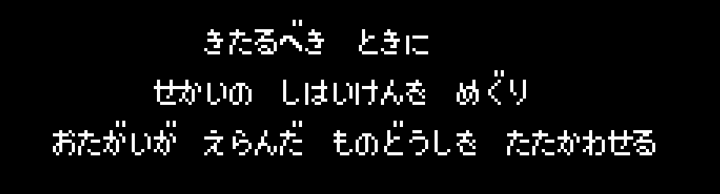

# Learning More About MMFC's Scripting

## Recap

In the previous session, we used an emulator's tile viewer and some deduction to figure out a few things about how text messages are displayed on screen. We discovered an indexed table and some of the behavior of the text rendering engine, though we haven't gone looking for that part in code yet. 

## Goals for this Session

At a minimum I'd like to:

* finalize the byte to text table with dakuten correctly indexed
* create a way to extract the script into strings
* create a way to convert the extracted script into a common format that can be rendered in a standard text editor (SHIFT-JIS, UTF-*, UNICODE, whatever)

I'm sure there are many other things that are text based in the game (character names, items, etc) that are rendered using different text engines, but we'll get to those things later. 

## Special Text Engine Directive Characters

From the previously observed sample:

```hex
@ 0x00024090 

bb bf bf bf 10 19 32 26 3e 90 1d 10 1f bc

bf bf 17 0f 0b a2 15 23 0b 12 37 b6 2b 11 3e 31 bc

0e 19 0f 3e 0b 0f 35 17 32 ff
```




There are several values greater than ``0x80`` in the text sample. I think ``0xbb`` and ``0xff`` are string beginning and ending characters. It looks like ``0xbc`` is a newline character and ``0xbf`` is used for one or more spaces to attempt to 'center' text in the box. 

| Hex Value | Purpose |
|:--:|:--------|
| 0xbb | message start |
| 0xbc | newline |
| 0xbf | double space in box |
| 0xff | message end |

These values are interesting because they would fall in the area where a space modified character MIGHT occur. I wonder if the table is structured in a way to avoid ``0x3b``, ``0x3c`` and ``0x3f``. 

Looking back at the table, those are 


Looking at the top line of the box again:

```hex
@ 0x00024090

bb bf bf bf 10 19 32 26 3e 90 1d 10 1f bc
St Sp Sp Sp き た  る へ ゛  き  と き に Nl
```

We get: 

> きたるべき  ときに
> 
> [Kitarubeki toki ni]
>
> (t-eng: "When the time comes", "In the time to come")

So it looks like the dakuten modify the *previous* character. 

## Fixing the issues with my lookup table

I didn't want to, but at this point I went through the PPU table and decided to map out what they actually were (as opposed to common charts). 

Here's the PPU table (I switched over to FCEUX):


And here's what I could glean from the PPU data:

| offset (0d) | offset (0x) | character | romaji |
|:----|:---|:---:|:---:|
| 0 |  0x00 | 0 | 0 |
| 1 |  0x01 | 1 | 1 |
| 2 |  0x02 | 2 | 2 |
| 3 |  0x03 | 3 | 3 |
| 4 |  0x04 | 4 | 4 |
| 5 |  0x05 | 5 | 5 |
| 6 |  0x06 | 6 | 6 |
| 7 |  0x07 | 7 | 7 |
| 8 |  0x08 | 8 | 8 |
| 9 |  0x09 | 9 | 9 |
| 10 |  0x0A | あ | a |
| 11 |  0x0B | い | I |
| 12 |  0x0C | う | u |
| 13 |  0x0D | え | e |
| 14 |  0x0E | お | o |
| 15 |  0x0F | か | ka |
| 16 |  0x10 | き | ki |
| 17 |  0x11 | く | ku |
| 18 |  0x12 | け | ke |
| 19 |  0x13 | こ | ko |
| 20 |  0x14 | さ | sa |
| 21 |  0x15 | し | si |
| 22 |  0x16 | す | su |
| 23 |  0x17 | せ | se |
| 24 |  0x18 | そ | so |
| 25 |  0x19 | た | ta |
| 26 |  0x1A | ち | ti |
| 27 |  0x1B | つ | tu |
| 28 |  0x1C | て | te |
| 29 |  0x1D | と | to |
| 30 |  0x1E | な | na |
| 31 |  0x1F | に | ni |
| 32 |  0x20 | ぬ | nu |
| 33 |  0x21 | ね | ne |
| 34 |  0x22 | の | no |
| 35 |  0x23 | は | ha |
| 36 |  0x24 | ひ | hi |
| 37 |  0x25 | ふ | hu/fu |
| 38 |  0x26 | へ | he |
| 39 |  0x27 | ほ | ho |
| 40 |  0x28 | ま | ma |
| 41 |  0x29 | み | mi |
| 42 |  0x2A | む | mu |
| 43 |  0x2B | め | me |
| 44 |  0x2C | も | mo |
| 45 |  0x2D | や | ya |
| 46 |  0x2E | ゆ | yu |
| 47 |  0x2F | よ | yo |
| 48 |  0x30 | ら | ra |
| 49 |  0x31 | り | ri |
| 50 |  0x32 | る | ru |
| 51 |  0x33 | れ | re |
| 52 |  0x34 | ろ | ro |
| 53 |  0x35 | わ | wa |
| 54 |  0x36 | ゐ | wi |
| not included ~~55~~ |  ~~0x37~~ | ~~ゑ~~ | ~~we~~ |
| 55 |  0x36 | を | wo |
| 56 |  0x37 | ん | n |
| 57 |  0x38 | ぃ | small i  |
| 58 |  0x39 | っ | sokuonfu |
| 59 |  0x3A | ゃ | small ya |
| 60 |  0x3B | ゅ | small yu |
| 61 |  0x3C | ょ | small yo |
| 62 |  0x3D | ゜ | dakuten |
| 63 |  0x3E | ゛ | dakuten |
| 64 |  0x3F |   | space |
| 65 |  0x40 | - | dash |
| 66 |  0x41 | H | cap H |
| 67 |  0x42 | M | cap M |
| 68 |  0x43 | P | cap P |
| 69 |  0x44 | $ | dolla |
| 70 |  0x45 | ー | choonpu |
| 71 |  0x46 | ! | exclamation |
| 72 |  0x47 | ? | question mark |
| 73 |  0x48 | . | period |
| 74 |  0x49 | ア | a |
| 75 |  0x4A | イ | I |
| 76 |  0x4B | ウ | u |
| 77 |  0x4C | エ | e |
| 78 |  0x4D | オ | o |
| 79 |  0x4E | カ | ka |
| 80 |  0x4F | キ | ki |
| 81 |  0x50 | ク | ku |
| 82 |  0x51 | ケ | ke |
| 83 |  0x52 | コ | ko |
| 84 |  0x53 | サ | sa |
| 85 |  0x54 | シ | si |
| 86 |  0x55 | ス | su |
| 87 |  0x56 | セ | se |
| 88 |  0x57 | ソ | so |
| 89 |  0x58 | タ | ta |
| 90 |  0x59 | チ | ti |
| 91 |  0x5A | ツ | tu |
| 92 |  0x5B | テ | te |
| 93 |  0x5C | ト | to |
| 94 |  0x5D | ナ | na |
| 95 |  0x5E | ニ | ni |
| 96 |  0x5F | ヌ | nu |
| 97 |  0x60 | ネ | ne |
| 98 |  0x61 | ノ | no |
| 99 |  0x62 | ハ | ha |
| 100 |  0x63 | ヒ | hi |
| 101 |  0x64 | フ | hu/fu |
| 102 |  0x65 | ヘ | he |
| 103 |  0x66 | ホ | ho |
| 104 |  0x67 | マ | ma |
| 105 |  0x68 | ミ | mi |
| 106 |  0x69 | ム | mu |
| 107 |  0x6A | メ | me |
| 108 |  0x6B | モ | mo |
| 109 |  0x6C | ヤ | ya |
| 110 |  0x6D | ユ | yu |
| 111 |  0x6E | ヨ | yo |
| 112 |  0x6F | ラ | ra |
| 113 |  0x70 | リ | ri |
| 114 |  0x71 | ル | ru |
| 115 |  0x72 | レ | re |
| 116 |  0x73 | ロ | ro |
| 117 |  0x74 | ワ | wa |
| not included? ~~119~~ |  ~~0x75~~ | ~~ヰ~~ | ~~wi~~ |
| not included? ~~120~~ |  ~~0x76~~ | ~~ヱ~~ | ~~we~~ |
| 118 |  0x75 | ヲ | wo |
| 119 |  0x76 | ン | n |
| 120 |  0x77 | ァ | small a |
| 121 |  0x78 | ィ | small i  |
| 122 |  0x79 | ェ | small e |
| 123 |  0x7A | ォ | small o |
| 124 |  0x7B | ッ | small tsu |
| 125 |  0x7C | ャ | small ya |
| 126 |  0x7D | ュ | small yu |
| 127 |  0x7E | ョ | small yo |

So with the new table, I wonder what happens if a dakuten 